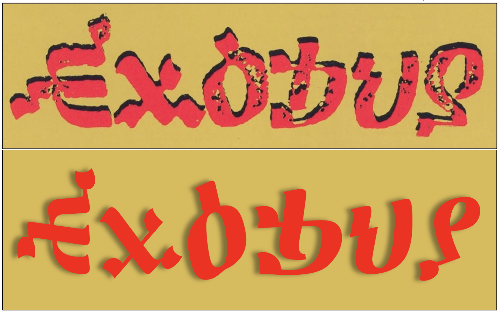

# Exodus — The Font
An approximation of the typeface used on the cover of Bob Marley's 1977 Exodus album,
created in celebration with the release of the 2024 film “One Love”.

The Exodus font is derived from the [Abyssinica SIL](https://software.sil.org/abyssinica/download/) font
whose Ethiopic (Geʻez) letters have been used as a basis for the Latin (English) letters of the font.

## Design Principles

The font was created with these simple design rules when selecting Ethiopic letters
that resemble Latin letters.

* “Exodus” must match the appearnce of the album cover.
* Ignore any phonetic equivalence, selections are purefly graphical.
* Do not make the most obvious choice. “ሀ” and “ዐ” graphically resemble “U” and “O” most closely,
  yet the Exodus album cover artist chose “ህ” and “ዕ”. 
* Scale the Ethiopic letters to match the heights of their Latin counterparts, but do not distort their shapes.
  Unfortunately enlarging the letters to match the heights of the Latin letters meant the letter weights would
  appear heavier.
* Letters can be combined.  The cover artist did this for “E” by combining “ሕ” and “ሒ”. 
* Match Latin uppercase only. Lowercase letters will be scaled versions of the uppercase, essentially “small caps".
* Maintain the Latin letter sidebearings.
* Do not corrupt an Ethiopic letter, except as an absolute last resort.

See the [FONTLOG.txt](FONTLOG.txt) for a list of the specific letter transforms made to create the font.

## Notes
Some Latin letters were particulary difficult to create from Ethiopic letters. Noteably F, G, K, M, N, and R. These
letters will likely be enhanced or redesigned entirely in the future.
